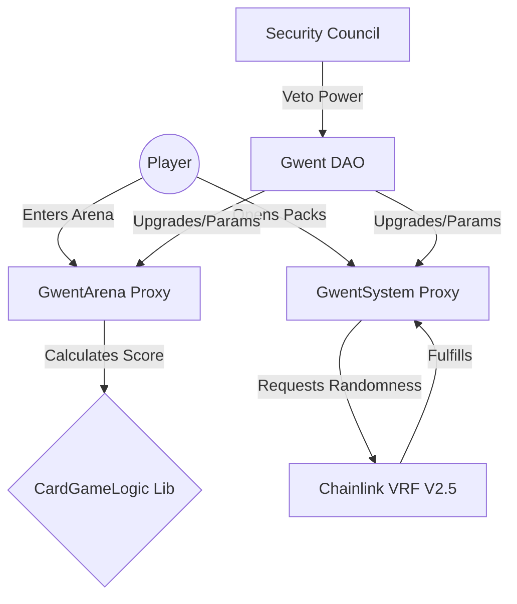

# 🃏 Decentralized Gwent Protocol

[](https://sepolia.arbiscan.io/)
[](https://opensource.org/licenses/MIT)

A provably fair, community-governed card game ecosystem built on **Arbitrum Sepolia**. This protocol merges high-fidelity strategy with decentralized trust, featuring a **UUPS-upgradeable** engine, **Chainlink VRF** randomness, and a robust **DAO-Guardian** security model.

> [!TIP]
> **New to the Arena?** Start with our [Step-by-Step Player Tutorial](./docs/TUTORIAL.md) to go from your first pack to your first victory.
> 
> Explore the [Combat & Scoring Guide](./docs/CARD_GAME_LOGIC.md) for deep-dives into unit abilities and arena laws.

---

## 🏛️ Architecture Overview

The protocol is designed for high scalability and modularity. Command-and-control logic is separated from the core game engine to minimize gas costs and maximize security.



---

## 🏛️ Governance & Security Model

We utilize a hybrid governance model that balances community ownership with protocol safety.

- **Governance Token**: `GwentCardToken`
- **Voting Unit**: **Game Currency (ID 0)**.
- **Voting Power**: 1 Unit (ID 0) = 1 Vote.
*   **Powers**: Adjusting protocol fees, updating contract logic, and managing the treasury.

### **2. The Security Council (Guardian Veto)**
*   **Role**: Acts as a "Circuit Breaker" for malicious governance attacks.
*   **Veto Power**: During the Timelock delay, a **66% Supermajority (2 of 3)** members can veto and cancel a proposal. 

---

## 📍 Deployed Addresses (Arbitrum Sepolia)

| Component | Target Address |
| :--- | :--- |
| **GwentGovernor** | `0x763ec857c1444a8D371435ED513F9852B7607263` |
| **GwentTimeLock** | `0xB9f3989d8740Ae6055Fb0e7Aeb6A93f176ca0A47` |
| **GwentCardToken** | `0x804671566D9e584145c0340B72aF5F9904974A66` |
| **GwentArena (Proxy)** | `0x7B417Fa3cfCA13A3b8B83703B8ACB4be3997c6Bd` |
| **GwentSystem (Proxy)** | `0x49eE0547272E50Fec45e8C11E0148BF97c803f24` |
| **WETH** | `0x9D3A4728d5e3006784d7F2a82dE8440031A7F70D` |

---

## 🛠️ Developer & Power-User Tools

### Build & Test
```bash
# Optimized via IR for large contract support
forge build --via-ir

# Execute the comprehensive test suite
forge test
```

### Interactive Validation (CLI)
Query the protocol directly from your terminal using `cast`:

**1. Inspect a Card's Human-Readable Data:**
```bash
cast call $SYSTEM_PROXY "InspectCard(uint16)(uint8,uint8,string,string,string)" <CARD_ID>
```

**2. Check Governance Role Status:**
```bash
cast call $ARENA_PROXY "hasRole(bytes32,address)(bool)" 0x00...00 $TIMELOCK
```

---

## 📜 Technical Highlights
*   **UUPS Proxy Pattern**: Future-proof logic upgrades with minimal gas overhead.
*   **Storage Gaps**: 50-slot `__gap` implementation ensures zero-collision upgrades to V2.
*   **Provable Fair**: Chainlink VRF V2.5 ensures pack generation is tamper-proof.
*   **Scalable Queue**: O(1) head-pointer matchmaking designed for thousands of active players.

---

## ⚖️ License
Licensed under **MIT**.
