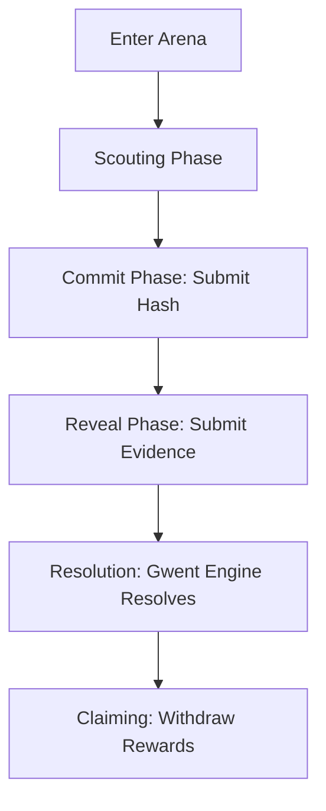

# 🃏 Master Class: Decentralized Gwent Protocol

Welcome, Witcher. This is the definitive technical manual for navigating the Decentralized Gwent Protocol. From your first transaction to the final victory in the Arena, this guide leaves no stone unturned.

---

## 📜 Table of Contents
1. [The Merchant’s Path: Acquisition](#-i-the-merchants-path-acquisition)
2. [The Witcher’s Arsenal: Collection Management](#-ii-the-witchers-arsenal)
3. [The Strategic Duel: Match Lifecycle](#-iii-the-strategic-duel)
4. [The Champion’s Reward: Resolution](#-iv-the-champions-reward)

---

## 💎 I. The Merchant’s Path: Acquisition

To play, you need Gwent Tokens (ID 0) and a deck of cards.

### 1. Funding your Journey
You can buy Gwent Tokens (ID 0) at a rate of 1 ETH = 1,000 Tokens. The `GwentCardToken` contract provides two entry points:
*   **With Native ETH**: Call `buyTokensWithNativeEth(uint256 tokenAmount)`. Ensure you send the correct `msg.value` (1 ETH per 1000 tokens).
*   **With WETH**: Call `buyTokensWithWeth(uint256 tokenAmount, uint256 maxWethToPay)`. You must approve the contract as a spender of your WETH first.

### 2. Opening Packs (The Newbie Bonus)
Once you have tokens, go to the `GwentSystem` contract to open a Faction Pack.
*   🎁 **The Welcome Gift**: The first time you open **any** pack, it is **FREE** and the system gives you **4 Packs** automatically in that single transaction.
*   **⚠️ One-Shot Warning**: You do NOT get 4 separate free choices. The moment you click "Open" for the first time, your newbie bonus is used up. 
*   **Strategic Tip**: Only **Northern Realms** (24 cards) gives you enough units to enter the Arena (Min 22) for free. 
*   **Subsequent Packs**: Cost 100 Gwent Tokens per pack amount.

### 3. The VRF & Claiming Workflow
Opening a pack is a two-step process due to the Chainlink VRF security:
1.  **Request**: Call the `open...Pack` function. This transaction emits a `PackOpened` event.
2.  **Find RequestID**: Go to your transaction logs on Arbiscan. Find **Topic [2]** of the `PackOpened` event. This is your unique `requestId`.
3.  **Claim**: Wait ~3 blocks for VRF fulfillment, then call **`claimRolls(requestId)`**. This officially mints the cards to your account.

---

## ⚔️ II. The Witcher’s Arsenal: Collection Management

### 1. Inspecting your Cards
To see exactly what a card does, call `InspectCard(cardId)` on the `GwentSystem` contract. It will return:
*   **Power / Berserker Power**
*   **Ability** (e.g., Spy, Medic, Scorch)
*   **Unit Type** (e.g., Close Combat, Agile, Special)
*   **Faction**

### 2. Deck Building Rules
To enter the Arena, your deck must follow these strict laws of the Continent:
*   **Unit Minimum**: Between **22** and **30** total unit cards. 
*   **Special Limit**: You can carry a maximum of **3 Special Cards** (Weather, Scorch, or Decoy) total in your deck. Choose them wisely.
*   **Round Limit**: During the battle, you are only allowed to play **one Special card per round**.
*   **Factions**: You must use cards belonging to your chosen Faction or Neutral cards. The Arena will reject "mutated" decks with mismatched faction cards.

---

## 🏟️ III. The Strategic Duel: Match Lifecycle

### 1. Entering the Arena
Call `enterArena(uint256[] ids, uint256[] amounts, uint256 stakeAmount)`.
*   **Wait Rewards**: Gain passive game currency for every block spent in the queue.
*   **Status**: Check `getPlayerEntry(your_address)` to see if `isMatched` is true.

> [!CAUTION]
> **Treat your Enrollment Seriously!** Once you enter the Arena and a match is found, your **unit cards** are locked to prevent cheating. However, **Game Currency (ID 0) remains liquid**—you can still buy packs or transfer currency while you are in the match.

### 2. Scouting
As soon as you are matched, get your `matchId` and call **`getMatchInfo(matchId)`**.
*   **Peeking**: You can see your **opponent's entire deck** here. This is not cheating; it is advanced scouting. Use it to plan your 3 rounds of moves now.

### 🧩 3. Encoding your Moves (The Master Class)
Each move in Gwent is a `uint256` value. Use the on-chain **`encodeCard`** helper in `GwentArena` to verify your math.

**The Bit-Map:**
| Bits | Value | Description |
| :--- | :--- | :--- |
| 0-15 | `cardId` | The unique ID of the card. |
| 16-23 | `targetRow` | 0=Close, 1=Ranged, 2=Siege. |
| 24-31 | `choice` | **Decoy**: Index of card to pull. **Scorch**: Preferred row. |
| 32-47 | `amount` | Number of this card played. |
| 48-63 | `spy1/medic` | Pre-encoded move of the **first card drawn**. |
| 64-79 | `spy2` | Pre-encoded move of the **second card drawn** (Spy only). |

> [!IMPORTANT]
> **Recursive Encoding**: If your card draws another card (like a Spy or Medic), you must decide exactly which card you will draw **during the commit phase** and pre-encode it into the `spy1` or `spy2` slots.
> 
> **🚫 The Anti-Loop Rule**: To keep the game balanced, a Spy cannot draw another Spy, and a Medic cannot revive another Medic. If you attempt to chain these recursive abilities, the "inner" ability will be ignored by the game engine.

### 🤝 4. The Commitment (The Seal)
Prepare 3 arrays of encoded moves (`uint256[]`) representing your 3 rounds of play.
1.  **Create Hash**: `keccak256(abi.encode(round1, round2, round3, your_secret_salt))`.
2.  **Commit**: Call `commitPlays(matchId, combinedHash)`.

---

## 🏆 IV. The Champion’s Reward: Resolution

### 1. The Reveal & Resolution
Once both players have submitted their secret "Seals" (hashes), the Reveal phase begins.
*   **Manual Reveal**: You must call **`revealPlays`** with the exact salt and arrays you committed. 
*   **Auto-Resolution**: The Gwent Engine resolves the game **instantly** the moment the second player's reveal is confirmed. The results are stored in the match state.

### 2. Prize Pools & House Fees
*   **The Pot**: The winner takes the total stake (Player 1 Stake + Player 2 Stake).
*   **House Fee**: A **2% fee** is deducted from the total prize pool to support the treasury and game maintenance.
*   **Example**: In a match where each player stakes 50 Tokens, the winner receives 98 Tokens (100 - 2%).

### 3. The Sentinel Path (Bounties & Guardians)
The Decentralized Gwent Protocol is self-maintaining. If a player stalls or disappears, the community can step in as **Sentinels**.

*   **Scouting for Stalls**: Any player can use **`getActiveMatches(offset, limit)`** to scan for ongoing matches. Look for games where the `commitDeadline` or `revealDeadline` has expired.
*   **The Trigger**: Once a deadline passes, anyone can call **`timeoutCommit(matchId)`** or **`timeoutReveal(matchId)`**.
*   **The Bounty**: The Sentinel who calls the timeout is immediately awarded a **1% bounty** from the prize pool.
*   **The Punishment**: The stalled player is automatically disqualified. This ensures the protocol stays "clean" and rewards active community guardians.

---

## 📊 Match Lifecycle Overview

